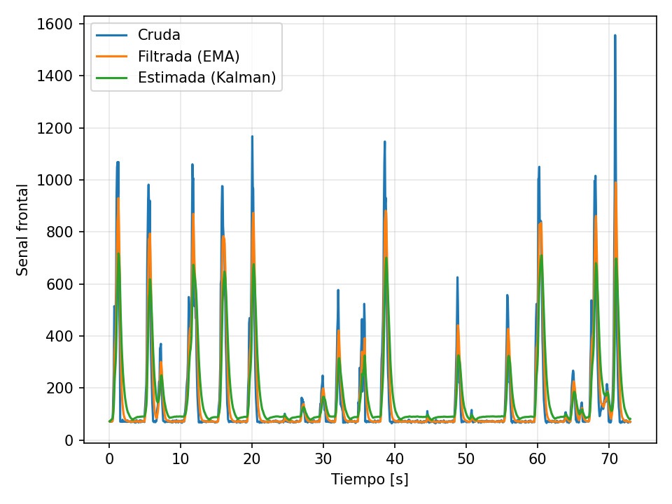

# Laboratorio 2: Navegación reactiva con filtrado y fusión de sensores en Webots

**Asignatura:** Robótica y Sistemas Autónomos
**Integrantes:**

- Sebastian Cruz
- Joaquin Fuenzalida
- Ignacio ávila
- Maximiliano Bustamante

## 1. Objetivo

Implementar un sistema básico de navegación reactiva en Webots para un robot móvil diferencial, utilizando sensores de distancia y encoders de rueda, aplicando filtrado sobre las mediciones y empleando un filtro de Kalman para estimar la distancia frontal a obstáculos y mejorar la toma de decisiones.

## 2. Descripción del Robot y Sensores

Para este laboratorio se utilizó el robot diferencial e-puck. La percepción del entorno y el cálculo de la odometría se basan en los siguientes sensores integrados:

- **Sensores de distancia infrarrojos (IR):** Se habilitaron los 8 sensores del e-puck (ps0 a ps7).
  - **Frontales:** Se combinaron las lecturas de ps0, ps7, ps1 y ps6 (tomando el valor máximo) para representar el obstáculo frontal más crítico de forma unificada.
  - **Laterales:** Se utilizaron ps5 y ps6 para el lado izquierdo, y ps1 y ps2 para el lado derecho, con el fin de calcular el diferencial de distancia lateral.
- **Encoders de rueda:** Se habilitaron los sensores angulares left wheel sensor y right wheel sensor para medir el desplazamiento en radianes de cada rueda.

## 3. Frecuencia de Muestreo

El ciclo de control y la toma de datos están sincronizados con el paso de simulación de Webots (TIME_STEP):

- **Tiempo de muestreo ($T_{s}$):** $0.064$ s (64 ms)
- **Frecuencia de muestreo ($f_{s}$):** $15.625$ Hz

## 4. Análisis de Señales Registradas

El gráfico registrado durante la simulación muestra las tres señales frontales a lo largo de aproximadamente 73 segundos de operación: la señal cruda del sensor IR, la señal filtrada por EMA y la estimación del filtro de Kalman.

La **señal cruda** (azul) presenta un comportamiento altamente ruidoso en los períodos de navegación libre, con una línea base que oscila en torno a los 70–100 u.a. incluso en ausencia de obstáculos cercanos, lo que evidencia el ruido inherente de los sensores infrarrojos del e-puck. Al aproximarse a un obstáculo, la señal exhibe picos abruptos y de gran amplitud, alcanzando valores superiores a 1000 u.a. en varios encuentros y llegando hasta ~1550 u.a. cerca del segundo 70. Estos picos son en general estrechos y rápidos, lo que sugiere que el sensor responde con sensibilidad a la proximidad pero con escasa suavidad temporal.

La **señal EMA** (naranja, $\alpha = 0.3$) reduce parcialmente las fluctuaciones de la línea base, pero dado el valor relativamente alto de $\alpha$, sigue el perfil de la señal cruda con cierto retardo. En los picos de mayor magnitud, la EMA logra atenuarlos moderadamente sin llegar a eliminar por completo las oscilaciones.

La **estimación de Kalman** (verde) es la más suave de las tres: en los períodos sin obstáculos mantiene una línea base estable y bien contenida, y en los eventos de aproximación sigue el crecimiento de la señal con menor sobreimpulso que la cruda, aunque con una respuesta que puede quedar ligeramente por debajo del pico real debido al peso de la covarianza de medición ($R = 200.0$). Esta característica es deseable para la toma de decisiones, ya que evita activaciones espurias del umbral de giro por ruido puntual.

## 5. Estimación y Filtrado

### 5.1 Estimación del Avance mediante Encoders

Los encoders entregan la posición angular acumulada en radianes. Sabiendo que el radio de las ruedas del e-puck es $r = 0.0205$ m, el desplazamiento lineal del robot en cada ciclo ($\Delta s$) se estimó calculando el promedio del avance del arco de ambas ruedas:

$$\Delta s = r \frac{\Delta \theta_{L} + \Delta \theta_{R}}{2}$$

### 5.2 Filtro Simple

Para suavizar las lecturas crudas y ruidosas de los sensores frontales, se implementó un filtro de **Media Móvil Exponencial (EMA)**. Se definió un coeficiente $\alpha = 0.3$, dándole un peso moderado a la medición actual y conservando el histórico reciente, mediante la siguiente ecuación:

$$EMA_{k} = \alpha \cdot \text{raw}_{k} + (1 - \alpha) \cdot EMA_{k-1}$$

### 5.3 Implementación del Filtro de Kalman

Para obtener una estimación robusta y estable de la distancia frontal, se fusionó la odometría (predicción) con la lectura de los sensores IR (corrección).

**1. Etapa de Predicción:** Se estimó el aumento en la señal del sensor IR asumiendo que el robot avanza frontalmente hacia un obstáculo. Se aplicó un factor de escala (`IR_SCALE = 500.0`) para convertir los metros avanzados a unidades brutas del sensor IR. Esta etapa solo se ejecuta cuando el robot avanza de frente (FORWARD o ESCAPE).

$$\hat{d}_{k}^{-} = \hat{d}_{k-1} + \text{IR}_{\text{SCALE}} \cdot \max(\Delta s, 0)$$

$$P^{-} = P_{k-1} + Q$$

_(Donde la varianza del proceso se configuró en $Q = 5.0$)_

**2. Etapa de Corrección:** Se actualizó la estimación utilizando la medición real (raw) de los sensores frontales.

$$K = \frac{P^{-}}{P^{-} + R}$$

$$\hat{d}_{k} = \hat{d}_{k}^{-} + K(z_{k} - \hat{d}_{k}^{-})$$

$$P = (1 - K)P^{-}$$

_(Donde la varianza de la medición se configuró en $R = 200.0$, asumiendo alto ruido en los sensores infrarrojos)._

## 6. Lógica de Navegación Reactiva

La toma de decisiones recae en una máquina de estados finitos alimentada por la variable estimada por el filtro de Kalman ($\hat{d}_{k}$).

1.  **Avance (FORWARD):** El robot avanza en línea recta a $5.0$ rad/s. Si la estimación frontal supera el umbral de proximidad (THRESHOLD_HIGH = 95.0`, se detiene el avance y evalúa el giro.
2.  **Decisión de Giro (get_turn_direction):** Se calcula la diferencia entre las mediciones laterales (izquierdas - derechas).
    - Si el obstáculo está más cerca por la izquierda, el estado cambia a TURN_RIGHT.
    - Si está más cerca por la derecha, el estado cambia a TURN_LEFT.
    - Se implementó un desempate de seguridad usando los sensores frontales extremos si la diferencia lateral es imperceptible.
3.  **Ejecución de Giro:** Se detiene la rueda interior ($0.0$ rad/s) y se hace girar la exterior a $3.5$ rad/s durante 10 ciclos de reloj (TURN_DURATION).
4.  **Evasión (ESCAPE):** Tras girar, el robot fuerza un avance recto durante 8 ciclos (ESCAPE_DURATION) para separarse del obstáculo antes de reiniciar su evaluación frontal, evitando bucles infinitos de giro en esquinas.

## 7. Gráficos de Señales

El siguiente gráfico muestra la evolución temporal de la señal frontal durante la simulación, comparando la lectura cruda del sensor IR, el filtrado por EMA y la estimación del filtro de Kalman. Cada pico corresponde a un evento de aproximación y evasión de un obstáculo.

## 8. Resultados en Escenarios de Prueba

- **Escenario Simple (escenario_simple.wbt):** En este escenario, con pocos obstáculos distribuidos en el espacio, el robot demostró un comportamiento estable y predecible. La máquina de estados transitó fluidamente entre los estados FORWARD, TURN_LEFT/TURN_RIGHT y ESCAPE, logrando evadir los obstáculos sin colisiones. El filtro de Kalman activó el umbral de giro (THRESHOLD_HIGH = 95.0) de forma oportuna, sin falsas detecciones por ruido puntual. La fase de ESCAPE de 8 ciclos fue suficiente para que el robot se alejara del obstáculo antes de retomar la evaluación frontal, evitando bucles de giro repetitivo.
- **Escenario Complejo (escenario_complejo.wbt):** En el laberinto de cajas, el robot enfrentó situaciones donde los obstáculos aparecían de forma sucesiva y desde distintos ángulos. La lógica de decisión lateral —basada en la diferencia entre ps5+ps6 (izquierda) y ps1+ps2 (derecha)— permitió seleccionar en la mayoría de los casos el lado con mayor espacio libre. En configuraciones de esquina o pasillo estrecho, la fase de ESCAPE resultó clave para romper posibles ciclos de giro, aunque en algunos casos el robot requirió más de un ciclo completo de evasión antes de encontrar una trayectoria libre. En general, el sistema logró navegar el escenario sin quedar atrapado de forma indefinida, validando la robustez de la estimación Kalman frente a la densidad de obstáculos del entorno.

## 9. Conclusiones

Los resultados de la simulación demuestran que el filtro de Kalman constituye una mejora sustancial frente al uso directo de las mediciones crudas de los sensores IR para la navegación reactiva. La señal cruda presenta un nivel de ruido persistente que, de usarse directamente como criterio de decisión, podría provocar activaciones espurias del umbral de giro y comprometer la estabilidad del comportamiento del robot. Si bien el filtro EMA logra atenuar parcialmente este ruido, su respuesta depende críticamente del coeficiente $\alpha$ elegido y no incorpora información del modelo cinemático del robot. El filtro de Kalman, al combinar la predicción basada en odometría con la corrección sensorial, obtiene estimaciones más coherentes con el estado real del sistema: suprime el ruido en régimen libre y responde de forma controlada ante la presencia real de obstáculos. Esto se traduce en una navegación más robusta y predecible, con menos falsas detecciones y una activación del mecanismo de evasión más oportuna. Como trabajo futuro, podría explorarse la sintonización adaptativa de los parámetros $Q$ y $R$ en función del estado de movimiento del robot, o la integración de un modelo de sensor IR no lineal para mejorar la etapa de corrección.

## 10. Instrucciones de Ejecución

1. Clonar este repositorio.
2. Abrir la aplicación Webots (Versión R2025a recomendada).
3. Cargar el mundo deseado (escenario_simple.wbt o escenario_complejo.wbt).
4. Verificar que el controlador del robot e-puck esté asignado como lab2_controller.
5. Ejecutar la simulación presionando el botón "Play".
